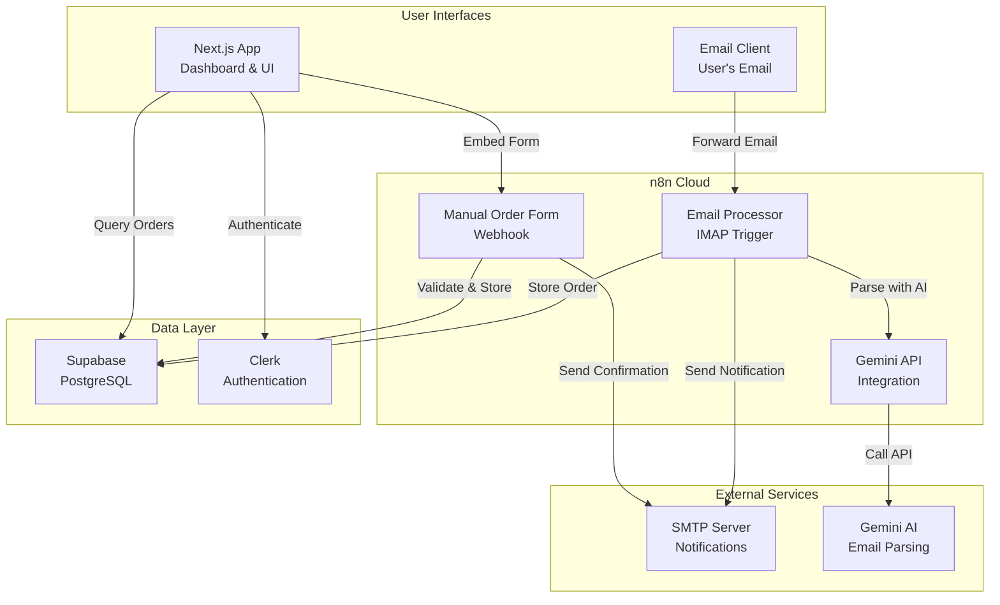

# WhatDidiShop MVP Architecture

## Overview

This document describes the simplified MVP architecture for WhatDidiShop, focusing on manual order entry and email forwarding through n8n, with plans for future OAuth integration.

## System Architecture



## Component Details

### 1. Next.js Application (Frontend)

**Responsibilities:**
- User authentication via Clerk
- Order management UI
- Dashboard and analytics
- Settings and profile management

**Key Features:**
- Server-side rendering for performance
- TypeScript for type safety
- Tailwind CSS for styling
- React Query for data fetching

**MVP Simplifications:**
- No direct order creation (uses n8n form)
- No OAuth email connection UI
- Focus on display and management only

### 2. n8n Cloud (Workflow Engine)

**Manual Order Workflow:**
- Public webhook creates form
- Validates user email against database
- Transforms data (Dutch number formats)
- Inserts order and items
- Sends confirmation email

**Email Forwarding Workflow:**
- IMAP polls sendto@whatdidi.shop
- Verifies sender is registered user
- Calls Gemini for parsing
- Handles duplicate detection
- Sends success/failure notification

**Benefits:**
- No code deployment for workflow changes
- Built-in error handling and retry
- Visual workflow debugging
- Scalable processing

### 3. Supabase (Database)

**Schema (Existing):**
```sql
-- Core tables used in MVP
users (
  id, clerk_id, email, name, created_at, updated_at
)

orders (
  id, user_id, order_number, retailer, amount, currency,
  status, tracking_number, carrier, order_date,
  estimated_delivery, email_account_id, raw_email_data,
  is_manual, needs_review, receipt_url, created_at, updated_at
)

order_items (
  id, order_id, description, quantity, price,
  product_name, product_sku, product_brand,
  product_category, image_url, product_url,
  created_at, updated_at
)
```

**MVP Usage:**
- `is_manual`: true for form, false for email
- `needs_review`: true when confidence < 0.7
- `raw_email_data`: stores email snippet
- `email_account_id`: null in MVP (Phase 2)

### 4. Gemini AI Integration

**Purpose:** Parse forwarded emails to extract order information

**Configuration:**
- Model: Gemini 2.0 Flash
- Languages: English and Dutch only
- Max tokens: 2048
- Temperature: 0.1 (consistent results)

**Prompt Strategy:**
- Clear extraction instructions
- Language-specific terms
- Structured JSON output
- Confidence scoring

### 5. Authentication (Clerk)

**Current Use:**
- User registration and login
- Session management
- Profile data sync to Supabase

**MVP Simplification:**
- No OAuth provider setup needed
- Just email/password or social login
- Webhook for user sync

## Data Flow

### Manual Order Entry Flow

1. User clicks "Add Order Manually" in dashboard
2. Modal opens with embedded n8n form
3. User fills form with order details
4. n8n webhook receives data
5. Validates user email exists
6. Transforms data (amounts, dates)
7. Inserts into orders table
8. Loops through items array
9. Sends confirmation email
10. Dashboard refreshes to show new order

### Email Forwarding Flow

1. User forwards order email to sendto@whatdidi.shop
2. n8n IMAP trigger polls every 5 minutes
3. Extracts sender, subject, body
4. Verifies sender is registered user
5. Prepares content for AI (10k char limit)
6. Calls Gemini API with en/nl prompt
7. Parses JSON response
8. Transforms data to match schema
9. Checks for existing order
10. Updates or inserts order
11. Sends notification email
12. User sees order in dashboard

## Security Architecture

### Authentication & Authorization
- Clerk handles all user authentication
- Supabase RLS policies enforce data access
- User can only see their own orders

### n8n Webhook Security
- Secure token in header (x-webhook-token)
- Token stored in n8n credentials
- Validation before processing

### Data Validation
- Input validation in n8n workflows
- Type checking and sanitization
- Length limits on all fields
- Email format validation

### API Security
- Gemini API key in n8n only
- No client-side API calls
- Rate limiting in workflows

## Deployment Architecture

### Production Environment
```
┌─────────────────┐     ┌──────────────┐     ┌─────────────┐
│  Vercel (CDN)   │────▶│  Next.js App │────▶│   Clerk     │
│   whatdidi.shop │     │  (Serverless)│     │   (Auth)    │
└─────────────────┘     └──────────────┘     └─────────────┘
                               │
                               ▼
                        ┌──────────────┐
                        │   Supabase   │
                        │  (Database)  │
                        └──────────────┘
                               ▲
                               │
┌─────────────────┐     ┌──────────────┐
│   n8n Cloud     │────▶│  Gemini API  │
│   (Workflows)   │     │   (Parsing)  │
└─────────────────┘     └──────────────┘
```

### Development Environment
- Local Next.js on port 3002
- n8n Cloud (same as production)
- Supabase project (dev branch)
- Clerk development keys

## Performance Considerations

### MVP Optimizations
- 5-minute email polling (balance between speed and cost)
- Batch processing in n8n when possible
- Caching user lookups
- Indexed database queries

### Scalability
- n8n Cloud auto-scales workflows
- Supabase handles connection pooling
- Vercel serverless for Next.js
- CDN for static assets

## Monitoring & Observability

### Application Monitoring
- Vercel Analytics for performance
- Sentry for error tracking
- Clerk dashboard for auth metrics

### Workflow Monitoring
- n8n execution history
- Workflow error notifications
- Success/failure metrics

### Database Monitoring
- Supabase dashboard
- Query performance insights
- Storage usage tracking

## Migration Path to Phase 2

### Current MVP Limitations
1. Manual email forwarding required
2. 5-minute delay for email processing
3. Limited to en/nl languages
4. No automatic scanning

### Phase 2 Additions
1. **OAuth Integration**
   - Gmail API connection
   - Outlook API connection
   - Token management

2. **Automatic Scanning**
   - Background job system
   - 15-minute intervals
   - Historical import

3. **Enhanced Features**
   - Multi-language (de/fr)
   - Delivery tracking
   - Advanced analytics

### Migration Strategy
1. Keep n8n workflows as fallback
2. Add OAuth UI components
3. Implement background workers
4. Gradual user migration
5. Maintain backward compatibility

## Cost Analysis

### MVP Costs (Monthly)
- n8n Cloud: ~$20 (Starter plan)
- Supabase: ~$25 (Pro plan)
- Gemini API: ~$5 (70k emails @ $0.00007)
- Vercel: ~$20 (Pro plan)
- Total: ~$70/month

### Phase 2 Additional Costs
- Background workers: +$10
- Increased API calls: +$20
- Additional storage: +$10
- Total: ~$110/month

## Rollback Procedures

### n8n Workflow Rollback
1. Keep previous workflow versions
2. One-click restore in n8n
3. Update webhook URLs if needed

### Database Rollback
1. Additive changes only (no drops)
2. Feature flags for new columns
3. Backward compatible code

### Application Rollback
1. Vercel instant rollback
2. Environment variable toggles
3. Feature flags in code

## Success Metrics

### Technical Metrics
- Email parsing accuracy: >80%
- Manual form completion: <30 seconds
- Processing time: <2 minutes
- System uptime: >99.9%

### Business Metrics
- User adoption rate: >60%
- Orders tracked per user: >5/month
- Support tickets: <5%
- User retention: >80%

## Conclusion

This MVP architecture provides a solid foundation for WhatDidiShop while maintaining simplicity and room for growth. The use of n8n for data ingestion allows rapid iteration without code deployments, while the core Next.js application focuses on providing an excellent user experience for order management and insights.